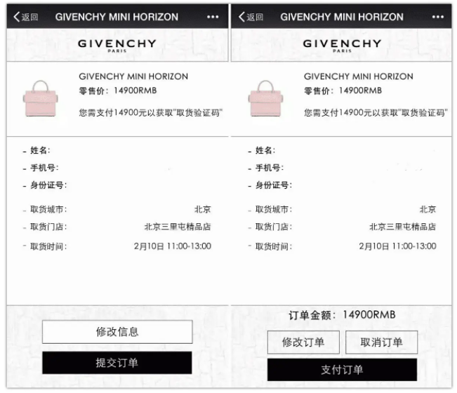

# **The Power of Social Media x FinTech**

# Introduction: Ingenuity leading the way

In this case study, we will explore how avenues of Social Networking Service (SNS) and FinTech (FT) combined, creates massive value for people in the 21st century. For the vehicle of study, we will take **WeChat**, a company devloped by **Tencent**, to disect how SM and FT dynamics are realised in the real world, also known as the marketplace.

In addition, we will uncover Wechat's competition and how we can utilise emerging technologies to solve intersting challenges which have risen between the relatively rapid explosion of technological development. Further enhancements to the functionaility of WeChat will also be recommended.

---

# Background: Tencent & WeChat

## Tencent
  
 *Fig1. Tencent's Logo Reference page https://www.tencent.com/*. 

**Tencent**, forged in 1998 and formally known as ***Tencent Holdings Ltd.***, is a major success story within the global FinTech arena, being the first asian Technology company to surpass the US$500 billion valuation mark in 2018 [^1], and owns stakes in over 600 individual firms[^2].

Amongst the vast array of FinTech domains in which Tencent operates, including e-commerce, music, electronic games, e-Sports, smartphones, along with the associated payment systems and other various useful internet functions [^3], in this case-study we will take a deep-dive snapshot into it's social media development, now known as **WeChat**.

We will soon discover how WeChat plays a significant role in encouraging the movement of money to generate value, to enable a large part of the population in China to collectively contribute towards building the largest growing economy in the world (GDP growth rate of 8.44% in 2021 [^4]). 

## WeChat

  
 *Fig2. WeChat's Logo Reference page https://www.wechat.com/*. 

On the surface, WeChat appears to be like any other Instant Messaging (IM)service, however further research diving deeper under the hood shows that it is clearly evident there are a number of other services [^5] which enable convieniance for users in the real world.

Social media is one aspect of capability which WeChat provides between users in addition to an IM service, all while enabling people to share their story and bring people together . WeChat is not the first platform to allow for SNS, in fact they were a little late to the game compared to other giants like Facebook [^6]. Nevertheless, the effects of social media in any industry has shown to generate astounding results, especially when it is inclusive of all people and is easy to use. The table below outlines the explosive user count expansion experienced by WeChat and it's subsequent business developments .

### Year vs User Count
| Tables | Number of Users | Next Business Move        |
|--------|:---------------:|-------------------------- |
|  2012  |   100 Million   | International market push |
|  2013  |   400 Million   | Launch of WeChat Payments |
|  2016  |   889 Million   | >90% of users from China  |
|  2019  |    1  Billion   | Active users              |

 *Table 1: Outlining WeChat user count history between 2012 and 2019*. 

The plethora of social users interested in WeChat was further fueled by the notable roll-out of the FinTech payments aspect into the application, called *'WeChat Payments'*, which contributed to adding more than 100 million new active users on average each year from 2013 to 2016 [^7]. How WeChat managed this notable feat of achievement was only due to the lack of an exisitng SNS platform in China but also the decision to integrate the *Quick Response (QR)* code technology for the frontend of payments between people, which escalated the utilisation of the application; this largly eliminated an individuals direct technical aptitude, paving the way for business growth [^8]. The shear volume of users, coupled with an easy-to-use integrated payments system, which is a unique story in its own right within the payments domain of FinTech.

---

# Benefits to Society
As a by-product of Tecent's success with WeChat, one of the major benefits *WeChat Payments* adds to an economy, in this case China, is that WeChat brought about a significant wealth imporvement to the lives of rural communities by means of an alternative payment method for those living in the countryside in addition to the city folk [^9] [^10] enabling value to be exchanged without the limitation of cumbersome tender which may not be available [^11] or an expensive to setup credit card system, such as Visa or Mastercard [^12].

This brings another interesting point to the marketplace, in terms of a payments system. It is irrespective of which country a service is created  or where the specific technology originated [^13] avaialble for a company to implement in their own development [^14], what is important is that the product brings value to its users. The concept of SM & FT bundled into one service has proven to work with staggering success and can potentially be replicated to raise the living standard for many people ~~in China~~ across the world [^15] [^16].

---

# Current Competition

There are many competitors in the domain of SNS, IM, and Payments platforms. They include the following:

### Social Networking
- Facebook
- LinkedIn

### Direct messaging
- Facebook Messenger
- WhatsApp
- Signal
- Telegram
- KakaoTalk
- Line

### Payments System
- PayPal
- Stripe
- Visa
- Mastercard

At this time, Facebook (along with WhatsApp) is the largest competitors to Tencent's WeChat in the SM and IM services. Facebooks SM platform has 2.89 billion active users [^17], while its subsidary messaging platform WhatsApp has 2 billion users [^18]. On the other hand, Tencent's WeChat has 1.25 billion active users [^19].

  
 *Fig3. WeChat's Logo https://www.facebook.com/*. 

The most signicant difference between Facebook/WhatsApp and Tencent's WeChat is that Facebook's business model revolves around tageting users with personised advertisments, while WeChat employs services other than advertsiing to genreate revenue. This is reflected in the profit distribution statements from each respective company. In 2017, 98% of Facebook's total revenues (USD$9.3 billion), were generated through social media advertising; while WeChat's revenues in the same sphere accounted around RMB6 billion (USD$0.9billion), noting that WeChat's other value-added services accounting for more than six fold compared to it's SNS advertising revenue (US$5.5 billion) [^20]. UponAnalysis metric of the revenue-to-user ratio, Facebook generates USD$3.22/user while WeChat realises USD$5.12/user.

### WeChat Advantages

- [x] Instant Messaging (IM)
- [x] Social Networking Service (SNS)
- [x] Entrepreneur account
- [x] Integrated Payments System
- [x] Usability
- [x] Additional functionalities uncommonly bundled else where

Though there are many competitors in the SM, IM, and payment/billing domain, Tencent's WeChat standsout by having already integrated various functionailities to capitalise in the FinTech payments domain, while others major competitors have barely begun their transition in the past two years [^21].

  
 *GIF 1.* [*Link to GIF above*](https://media.giphy.com/media/pjd6Oggp5BIzJp33CK/giphy.gif). 

---

## Successes brings new Challenges 

As a result of an integrated SM/IM/Payments system, WeChat has witnessed tremendous growth, which can be further augmented by emerging technologies. 
WeChat is seen by many western firms to be a portal into the much 'unexplored Chinese markets'. Take for example Givenchy Paris, a fashion brand looking to raise awareness in China. Givenchy partnered with WeChat to advertise utilising a native WeChat application to promote their brand and new products, harnessing WeChat's established digital environment. The product was a limited edition 'collection' handbag with 80 units on sale; in less than 12 minutes, the line was sold out[^22].

  
 *Fig4. Givenchy Advertisement Image [*Reference here*](https://nealschaffer.com/5-brands-case-studies-wechat/). 

Givenchy is not the only brands to see success on WeChat, and the likes of Montblanc, Mulberry, Calvin Klein, Coach, and many other highend companies have also reaped rewards [^23].

In addition, not only are companies benefiting, sometimes international government organisations, such as Tourism New Zealand, have also seen a boost; adding 40 million new followers, and conjouring 540 new aricltes worth USD$2.4 million [^24].

  
 *Fig5. Key Opinion Leader (KOL) Yao Chen advertises for Tourism New Zealand Image [*Reference here*](https://www.luxion.com.au/social-media/20-brilliant-weibo-and-wechat-marketing-case-studies-to-inspire-your-chinese-marketing-success/#casestudy4). 

The success of product marketing has also presented a unique challenge within the sucessful WeChat ecosystem. There have been cases where individual sellers on the platform have begun to sell counterfiet luxury goods, also known as 'high quality fake' luxury goods then proceed to sell those items at noticably lower price-points or even at the same price as the genuines [^25]. Health products are more of a concern because some genuine products contain hormones, which counterfiet products cannot exactly replicate, putting risk on the consumer [^26]. Currently there is no strongly enforced supervision mechanism in WeChat, effectively enabling the continued questionable activities of counterfit sellers.

---

# Recommendations

## Blockchain to verify Authenticity

A solution to this for WeChat to automate the 'genuine product' check without forming a large department dedicated, to enforce legitamate items, is to augment emerging technologies such as blockchain to verify products. This can be carried out by partnering genuine brands to implement a simple database to hold record of their product, allowing consumers to check their product to a companies supply, and creating value for both parties, as well as WeChat or any other store. As blockchain acts as a ledger and data is immutable [^27], not only can luxury consumers verify their product is indeed genuine, but further value can be realised by providing tokens to the buyer from a select blockchain, such as creating a purpose built Ethereum token [^28] to fasttrack this process for WeChat.

## Additional Enhancements to Grow FinTech Domain

**WeChat Mini Games** is another area where WeChat has diversified into with success [^29] [^30] and the proven SNS and FinTech technologies avaialble to Tencent can be applied to increase interest for the company and those wishing to do business with subsidary WeChat firm. WeChat Mini Games comprises of a multitude of easy-to-play electronic games, which has the ability to incorporate brands within games [^31]. Games are a natural way for users to interact and learn which is a feature of the human mind being explored amongst academics in the digital age [^32], therefore, incepting brands to players is so much a farfetched idea. To further pique the interest of users, WeChat can implement a **play-to-earn** blockchain for its users, a methodology to reward players who play games [^33] and entice new potential users. An extension to this is to add additional functionaility, such as Non-Fungible-Tokens (NFTs) as rewards or purchase items; adding to the current excitment in the FinTech industry [^34]. Essentially, the effects of Play-to-Earn would supplement the incentive for users to continue playing, enabling the extended opportunity for players to be exposed to relevant advertisements or cognating users with brands which are integrated into WeChat Mini Games.

---

[^1]: Most Valuable Company in Asia. https://web.archive.org/web/20171117003210/http://www.firstpost.com/tech/news-analysis/tencent-posts-69-percent-jump-in-quarterly-net-profit-becomes-the-most-valuable-company-in-asia-4211333.html. Retrived 30 August 2021.

[^2]: Tencent grows profits with aggressive investment strategy. South China Morning Post. 16 January 2019. Archived from the original on 16 January 2019. https://www.scmp.com/tech/big-tech/article/2182193/tencent-plugs-holes-and-boosts-profits-163-new-investments. Retrived 30 August 2021.

[^3]: Various Internet functions https://techcrunch.com/2008/03/27/for-chinese-im-portal-tencent-the-money-is-in-micro-transactions/. Retrived 30 August 2021.

[^4]: GDP Global Statistics https://statisticstimes.com/economy/projected-world-gdp-ranking.php. Retrived 30 August 2021.

[^5]: WeChat's World. https://www.economist.com/business/2016/08/06/wechats-world. Retrived 01 October 2021. 

[^6]: Facebook Founded. https://www.fastcompany.com/59441/facebooks-mark-zuckerberg-hacker-dropout-ceo. Retrived 01 October 2021. 

[^7]: Custer, C. (18 April 2016). "WeChat blasts past 700 million monthly active users, tops China's most popular apps". Tech in Asia. Archived from the original on 25 August 2017. Retrieved 03 October 2021.

[^8]: "Payment methods in China: How China became a mobile-first nation". https://daxueconsulting.com/payment-methods-in-china/. Retrieved 03 October 2021.

[^9]: China’s Alipay and WeChat Pay: Reaching Rural Users. https://openknowledge.worldbank.org/handle/10986/30112. Retrieved 03 October 2021.

[^10]: E-Commerce helping Rural Farmers. https://techwireasia.com/2020/01/how-e-commerce-is-helping-farmers-in-rural-china-sell-apples-and-peppers/. Retrved 03 October 2021.

[^11]: How QR codes are changing the touch-free payments experience. https://www.brookings.edu/wp-content/uploads/2020/04/FP_20200427_china_digital_payments_klein.pdf. Retrved 03 October 2021

[^12]: How Much Does a Credit Card Machine Cost?. https://tidalcommerce.com/learn/credit-card-machine-cost. Retrved 04 October 2021.

[^13]: The Little-Known Story of the Birth of the QR Code. https://www.nippon.com/en/news/fnn20191214001/the-little-known-story-of-the-birth-of-the-qr-code.html. NHK World-Japan. Retrived 04 October 2021.

[^14]: How QR codes are changing the touch-free payments experience. https://www.adyen.com/blog/three-ways-QR-codes-are-changing-touchless-commerce. 

[^15]: How China Is Changing Your Internet - The New York Times on YouTube Published on 9 August 2016. https://www.nytimes.com/video/technology/100000004574648/china-internet-wechat.html. Retrieved 04 October 2021.

[^16]: Is China’s new payment system the future? https://www.brookings.edu/research/is-chinas-new-payment-system-the-future/. Retrieved 04 October 2021.

[^17]: Monthly Facebook Users. https://www.statista.com/statistics/264810/number-of-monthly-active-facebook-users-worldwide/. Retrieved 04 October 2021.

[^18]: Monthly WhatsApp Users. https://www.statista.com/topics/2018/whatsapp/. Retrieved 04 October 2021.

[^19]: Monthly WeChat Users. https://www.statista.com/statistics/255778/number-of-active-wechat-messenger-accounts/. Retrieved 04 October 2021.

[^20]: Liu, Yujing (3 October 2017). "Tencent eyes US for new growth in social media ad business". South China Morning Post. Archived from the original on 10 November 2017. Retrieved 11 November 2017.

[^21]: WhatsApp Payments Trial in India. https://www.theverge.com/2020/11/6/21552325/whatsapp-payment-service-india-launches-regulatory-approval-upi-graded-ncpi. Retreived 04 Oct 2021.

[^22]: Past Successes for WeChat Advertising. https://nealschaffer.com/5-brands-case-studies-wechat/. Retreived 04 Oct 2021.

[^23]: WeChat Marketing for Brands. [https://www.luxion.com.au/social-media/20-brilliant-weibo-and-wechat-marketing-case-studies-to-inspire-your-chinese-marketing-success/. Retreived 04 Oct 2021.

[^24]: Tourism New Zealand Government agency success. https://www.luxion.com.au/social-media/20-brilliant-weibo-and-wechat-marketing-case-studies-to-inspire-your-chinese-marketing-success/#casestudy4. Retreived 04 Oct 2021.

[^25]: From Handbags To Wine, China’s Luxury Counterfeiters Flee To WeChat. https://jingdaily.com/from-handbags-to-wine-chinas-luxury-counterfeiters-flee-to-wechat/. Retreived 04 Oct 2021.

[^26]: Unsafe product alert: be very, very careful what you buy on WeChat. https://www.techinasia.com/unsafe-product-alert-careful-buy-wechat]. Retreived 04 Oct 2021.

[^27]: Key features of Blockchain for the investor. https://www.investopedia.com/terms/b/blockchain.asp. Retreived 04 Oct 2021.

[^28]: Ethereum more than just currency. https://ethereum.org/en/what-is-ethereum/. Retreived 04 Oct 2021.

[^29]: WeChat Mini Games monitisation. https://www.voguebusiness.com/technology/we-chat-mini-games-burberry-dior-livestreaming-monetisation#:~:text=WeChat%20mini%20games%20are%20low,race%20friends%20on%20Burberry%20surfboards Retreived 04 Oct 2021.

[^30]: Tencent’s mobile gaming dominance helps profits soar. https://www.ft.com/content/e79b1a78-3afd-11e7-821a-6027b8a20f23. Retreived 04 Oct 2021.

[^31]: Why Burberry and Gucci are betting on mini-games. https://www.wired.co.uk/article/burberry-gucci-mini-games. Retreived 04 Oct 2021.

[^32]: Academic paper on "Games & Learning". https://www.bvekennis.nl/wp-content/uploads/documents/05-0872-games-and-learning.pdf. Retreived 04 Oct 2021.

[^33]: How Play-to-Earn works. https://www.playtoearn.online/. Retreived 04 Oct 2021.

[^34]: "The NFT Market Tripled Last Year, and It's Gaining Even More Momentum in 2021". Morning Brew. https://www.morningbrew.com/emerging-tech/stories/2021/02/22/nft-market-tripled-last-year-gaining-even-momentum-2021?__cf_chl_jschl_tk__=pmd_NZAWs9cFv7zmCQSUFiKSsNq.qrOLL7CJmQ884Go4S_A-1633328941-0-gqNtZGzNAnujcnBszQil Retreived 04 Oct 2021.

